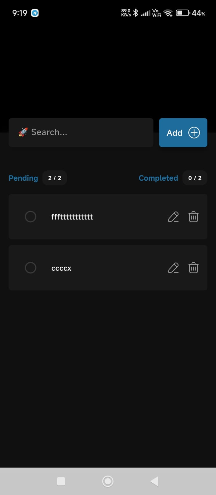
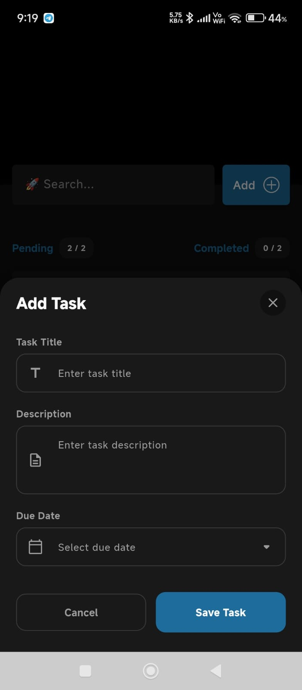
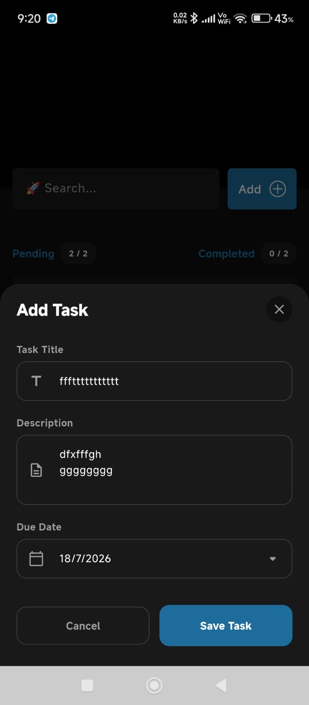
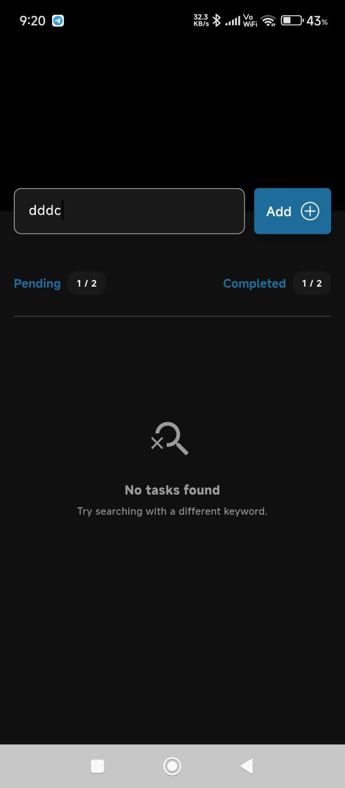
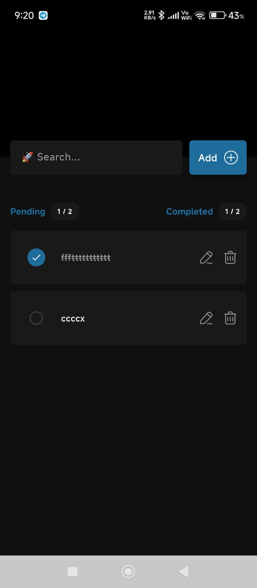

<p align="center">
  
</p>

# To-Do List App

A simple and modern **To-Do List** application built with **Flutter** and **Firebase Firestore**. The app allows users to create, update, delete, search, and manage daily tasks with a clean and intuitive user interface.

---

## Features

- Add new tasks
- Edit existing tasks
- Delete tasks
- Mark tasks as completed or pending
- Search tasks by title, description, or due date
- Select a due date for each task
- Store tasks securely using Firebase Firestore
- View completed and pending task statistics
- Clean and responsive UI

---

## Screenshots

| Home Screen | Add Task | Edit Task |
|:-----------:|:--------:|:---------:|
|  |  |  |

| Search | Completed Tasks |
|:------:|:---------------:|
|  |  |

---

##  Tech Stack

- Flutter
- Dart
- Firebase Firestore
- Provider (State Management)
- Material Design

---

##  Project Structure

```text
lib/
├── controllers/
├── core/
├── model/
├── repository/
├── screens/
├── state/
└── main.dart
```

---

##  Assets Structure

```text
assets/
├── icons/
│   ├── add.png
│   ├── delete.png
│   └── edit.png
│
└── readme/
    ├── banner.png
    └── screenshots/
        ├── home.jpeg
        ├── add_task.jpeg
        ├── edit_task.jpeg
        ├── search.png
        └── completed.jpeg
```

##  Getting Started

### Prerequisites

- Flutter SDK
- Dart SDK
- Firebase Project
- Android Studio or VS Code

### Installation

#### 1. Clone the repository

```bash
git clone https://github.com/abdul-bas/todo-list-app.git
```

#### 2. Navigate to the project

```bash
cd todo-list-app
```

#### 3. Install dependencies

```bash
flutter pub get
```

#### 4. Run the application

```bash
flutter run
```

---

##  Dependencies

```yaml
provider:
firebase_core:
cloud_firestore:
intl:
```

---

##  Future Improvements

- Firebase Authentication
- Dark Mode
- Task Reminders
- Offline Support


---

## 👨‍💻 Author

**Abdul Basith**
**Flutter Developer**

📧 **Email:** basithchempan8590@gmail.com
🔗 **GitHub:** https://github.com/abdul-bas
🔗 **LinkedIn:** https://www.linkedin.com/in/abdul-basith-chempan-b17b09324/

---

<p align="center">
Thank you for taking the time to review this project and I'm actively seeking Flutter Developer opportunities and would love to connect.
</p>